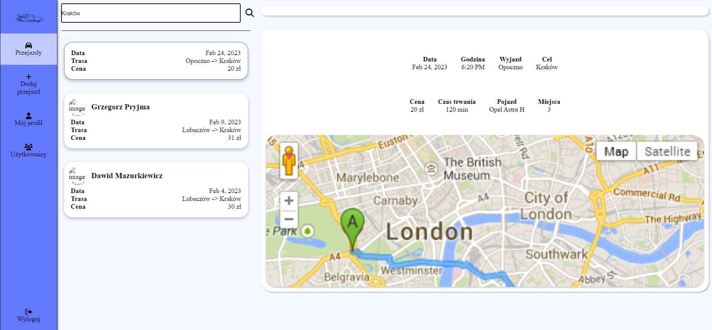

## BlaBlaCar
The web application provides functionalities to create car rides from specific places to specific destinations.
User is enabled to set departure place, destination, date of the journey, quantity of seats, price for each seat and vehicle model.
There is a functionality for searching travel and rating the driver on a scale from one to five and commenting the driver.

## Table of contents
* [Team members](#team-members)
* [Technologies](#technologies)
* [Functionalities](#functionalities)
* [Configuration](#configuration)
* [Site](#configuration)

# Team members
* Dawid Mazurkiewicz
* Grzegorz Pryjma
* Kamil Maksymowicz

##Technologies
* Angular
* Firebase
* JavaScript
* HTML 5
* CSS3 (SCSS)
* TypeScript

##Functionalities
* Booking trips from any place to any destination at any date
* Creating trips
* Rating and commenting drivers
* Searching for any trips created
* Signing In via Google Oauth
* Editing user profile

##Configuration
1. App configuration is included in a `enviroment.ts` file.
2. Install all necessary tools and libraries from `package.json` using ```npm install```
3. Install json-server with ```npm install -g json-server```
4. Run database with ```json-server --watch db.json```
5. Run application locally with a command ```ng serve```
6. Open application on browser via ```http://localhost:4200/```

## Site
Main page
<p align="center">
  
</p>

Create travel
<p align="center">
  
</p>

Search travel
<p align="center">
  
</p>

User profile
<p align="center">
  
</p>

Users
<p align="center">
  
</p>

Rate user
<p align="center">
  
</p>
